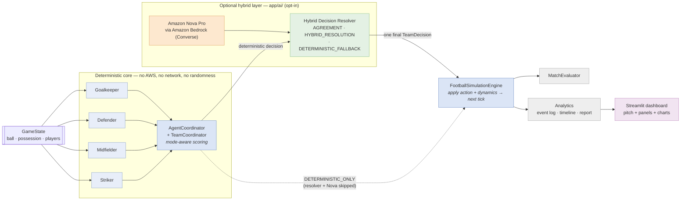
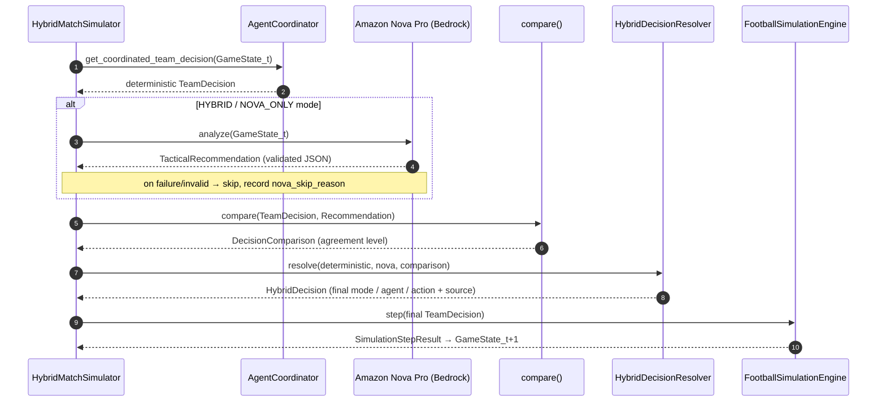
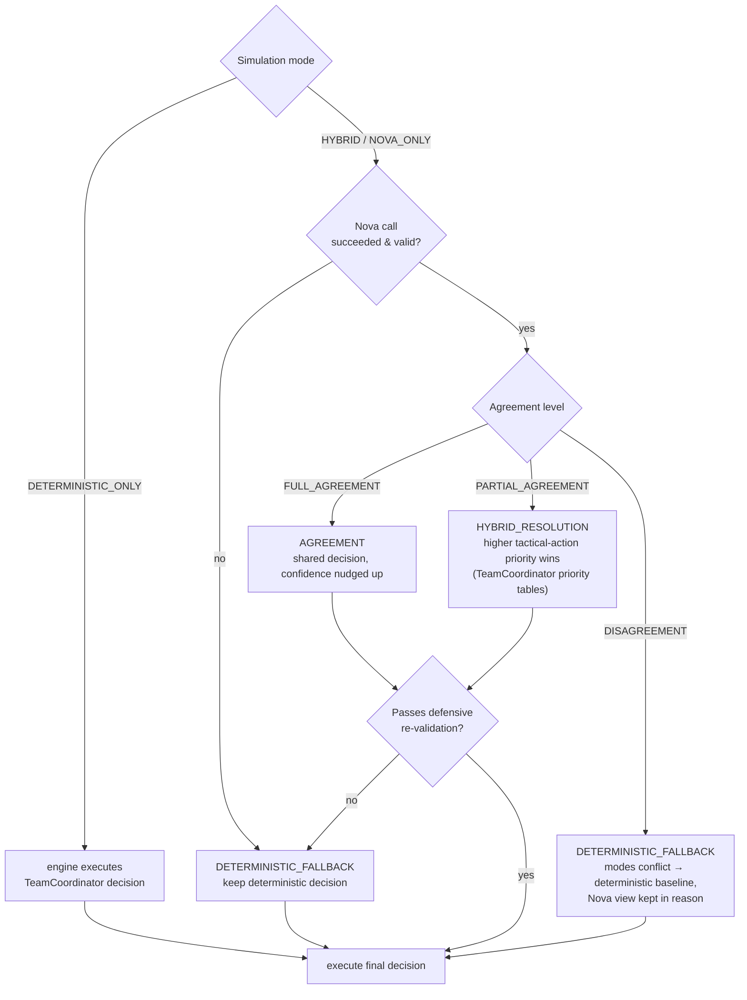

# Architecture

One-page overview of the Agentic Football Tactical AI. For the deep dive
on any component, follow the section links into [`README.md`](README.md).

> The diagrams below are [Mermaid](https://mermaid.js.org/) and render
> automatically on GitHub. The same picture is available live inside the
> Streamlit dashboard under **System architecture**.

---

## 1. System at a glance

Two things sit beside the runtime rather than inside it:

* **`app/strands/`** – LLM-free adapters shaped like `strands.Agent`
  (input → tool calls → structured result). A future Bedrock agent swaps
  only the adapter classes; the tools and the deterministic brain do not
  change. (README §8–9)
* **`app/evaluation/`** – a 16-scenario benchmark that calls the real
  `AgentCoordinator` and reports PASS/FAIL + per-category accuracy. It is
  the yardstick a future LLM layer is measured against. (README §6)

---

## 2. One hybrid tick, step by step

`DETERMINISTIC_ONLY` mode skips steps 3–8 entirely and lets
`FootballSimulationEngine.step()` pick the decision itself.

---

## 3. How the final decision is chosen

Deterministic and reproducible: identical inputs always give an identical
`HybridDecision`. Only the live Nova Pro response itself varies run to run.

---

## 4. Components

| Package | Responsibility | AWS? | README |
|---|---|---|---|
| `app/core/game_state.py`, `decisions.py`, `field.py` | domain model: `Position` / `Player` / `GameState` / `FootballAction` / `FootballDecision` | no | §2 |
| `app/agents/` | one deterministic if/else agent per role + `AgentCoordinator` | no | §3 |
| `app/core/team_coordinator.py` | scoring model → single `TeamDecision` (`action_priority + role_bonus + confidence*10`) | no | §2 |
| `app/core/simulation.py`, `dynamics.py` | advance the world one tick; `step(team_decision=None)` executes an external decision when given one | no | §11 |
| `app/core/evaluator.py`, `match_runner.py` | match history → readable metrics | no | §1 |
| `app/ai/bedrock_client.py`, `tactical_prompt.py`, `response_parser.py`, `bedrock_nova.py` | GameState → Converse prompt → Nova Pro → **validated** `TacticalRecommendation` | **yes** | §10 |
| `app/ai/decision_comparator.py`, `hybrid_analyzer.py` | deterministic vs Nova agreement metrics (read-only) | yes | §11 |
| `app/ai/decision_resolver.py` | merge deterministic + Nova → one `HybridDecision`; deterministic + reproducible | no | §11 |
| `app/ai/match_simulator.py` | `HybridMatchSimulator`: tick-by-tick match in a `SimulationMode`; per-tick fallback; `statistics` | mode-dependent | §11 |
| `app/analytics/` | `build_event_log` / `format_timeline` / `analyze` / `format_analytics` – read-only, deterministic | no | §12 |
| `app/strands/` | LLM-free Strands-style adapters + tool wrappers | no | §8 |
| `app/evaluation/` | benchmark runner + scenario library | no | §6 |
| `ui/app.py`, `ui/pitch.py` | Streamlit dashboard + pure-SVG pitch renderer; thin presentation layer over the packages above | UI opt-in | §5 |

---

## 5. Design invariants

1. **The deterministic core is the source of truth.** Nova Pro is
   advisory. Agent rules, benchmark scenarios, and their expected
   outputs are never changed to accommodate the LLM.
2. **Opt-in AWS.** Nothing calls Bedrock unless a hybrid `SimulationMode`
   (or a live-Nova test) is explicitly selected. Every hybrid path has a
   deterministic fallback (`decision_source = DETERMINISTIC_FALLBACK`).
3. **No duplicated logic.** The benchmark, the analytics, the Strands
   adapters, and the UI all *call* the existing modules; they never
   re-implement tactical, simulation, or scoring behaviour.
4. **Determinism.** Same input → byte-identical output for the whole
   core, the benchmark, and the analytics. Only live Nova Pro responses
   vary.
5. **Validation before use.** Nova output outside the real
   `FootballAction` enum / tactical modes, or naming a player absent from
   the current `GameState`, is rejected by the parser.
6. **The UI only reads results.** Running a match is the one action that
   executes the pipeline; tick navigation replays stored `GameState`
   snapshots and never triggers a simulation or an AWS call.
