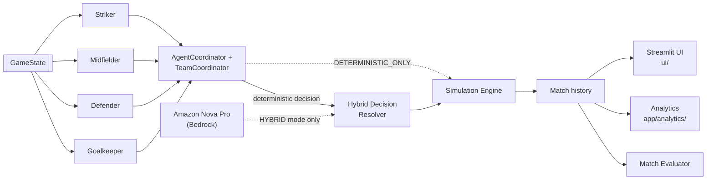

# AWS AI League – Agentic Football

A multi-agent system that decides what a football (soccer) team should do
in any given moment of a match, then simulates, scores, and visualises the
result.

The **core is fully deterministic** – specialised per-role agents, a
tactical-scoring team coordinator, a simulation engine, and an evaluation
benchmark – and runs with **no AWS account, no API keys, no network, no
randomness**. Run it twice with the same input and you get exactly the
same output.

On top of that sits an **optional hybrid layer** (`app/ai/`) that adds
**Amazon Nova Pro** tactical reasoning through **Amazon Bedrock**. It is
**advisory** and opt-in: nothing calls Bedrock unless you explicitly ask
for a hybrid mode. If AWS is unavailable, every hybrid path falls back to
the deterministic decision.

A **Streamlit dashboard** (`ui/`) is the visual front-end: pick a
scenario, choose deterministic or hybrid mode, run the match, then step
through it tick-by-tick on a rendered football pitch with full decision,
agreement, and analytics breakdowns.

> **New here?** Read [`ARCHITECTURE.md`](ARCHITECTURE.md) for the one-page
> system overview, then [`DEMO.md`](DEMO.md) for a 5-minute guided walk-through.

---

## 1. The big picture



Full diagrams (this flow, a per-tick sequence diagram, and the
decision-resolution logic) are in [`ARCHITECTURE.md`](ARCHITECTURE.md).

<details><summary>Same picture as ASCII</summary>

```
GameState  (where every player and the ball are, who has possession)
    |
    v
Specialized Agents        one decision per role
    |  GoalkeeperAgent / DefenderAgent / MidfielderAgent / StrikerAgent
    v
AgentCoordinator          collects all four decisions
    |
    v
TeamCoordinator           scores the decisions and picks ONE team action
    |  (tactical-mode aware: ATTACK / DEFENSE / TRANSITION)
    |
    |  ---- optional hybrid layer (app/ai/, opt-in) --------------------
    |    Amazon Nova Pro (Bedrock) proposes a recommendation
    |    HybridDecisionResolver merges deterministic + Nova -> one decision
    |    (falls back to deterministic on any failure)
    |  ----------------------------------------------------------------
    v
Simulation Engine         applies the final action, advances all players one tick
    |
    v
Match History             the list of every tick
    |
    +--> Match Evaluator       history -> readable metrics
    +--> Analytics (app/analytics/)   event log / timeline / aggregated report
    +--> Streamlit UI (ui/)           pitch visualization + dashboards
```

</details>

Alongside the runtime sits a **local agent pipeline** (`app/strands/`)
that mirrors the shape of a real Strands agent but calls the tools
directly instead of asking an LLM, and the **Evaluation Benchmark**
(`app/evaluation/`) which checks the football brain against a library of
16 hand-designed situations.

---

## 2. Core concepts (read this first)

| Term | What it means |
|---|---|
| **`Position`** | An `(x, y)` point on the pitch. `x` runs 0–100 from our goal to the opponent goal; `y` runs 0–100 across the width. Defined in `app/core/game_state.py`. |
| **`Player`** | `player_id`, `role` (`GOALKEEPER` / `DEFENDER` / `MIDFIELDER` / `STRIKER`), and a `Position`. |
| **`GameState`** | The whole world at one instant: `ball_position`, `our_team` (list of `Player`), `opponent_team`, and `possession` (`"OUR_TEAM"` or `"OPPONENT_TEAM"`). |
| **`FootballAction`** | The five things an agent can decide to do: `PASS`, `SHOOT`, `PRESS`, `MOVE`, `HOLD_POSITION`. |
| **`FootballDecision`** | One agent's answer: an `action`, an optional `target_player_id`, an optional `target_position`, a `confidence` (0–1), and a plain-English `reason`. |
| **Tactical mode** | Derived from possession by the `TeamCoordinator`: we have the ball → `ATTACK`; opponent has the ball → `DEFENSE`; anything else → `TRANSITION`. |
| **`TeamDecision`** | The team-level result: the chosen `primary_agent`, `primary_action`, the `tactical_mode`, every individual `agent_decisions`, and any detected `conflicts`. |

### How the team picks ONE action

Each agent proposes a decision. The `TeamCoordinator`
(`app/core/team_coordinator.py`) gives every proposal a score:

```
final_score = action_priority(mode) + role_relevance_bonus + confidence * 10
```

* **`action_priority`** depends on the tactical mode. In `ATTACK`,
  `SHOOT` (100) beats `PASS` (80) beats `MOVE` (60)… In `DEFENSE`,
  `PRESS` (100) comes first. This term dominates, so a confident
  goalkeeper wanting to `HOLD_POSITION` can never outrank a striker
  `SHOOT` in attack.
* **`role_relevance_bonus`** is a small nudge (max 15) when a role does
  its natural job (striker shooting, defender pressing).
* **`confidence * 10`** only separates decisions that are otherwise
  equal – it can never jump a whole priority tier.

Ties are broken by a fixed per-mode role order, so the result is 100%
deterministic.

---

## 3. Project layout

Everything lives under the `app/` package.

```
app/
  agents/                the football "brain"
    base.py              BaseFootballAgent (abstract: .decide(game_state))
    goalkeeper.py        one file per role, pure if/else rules
    defender.py
    midfielder.py
    striker.py
    coordinator.py       AgentCoordinator: runs all four, then TeamCoordinator

  core/                  the deterministic world + shared helpers
    game_state.py        Position / Player / GameState
    decisions.py         FootballAction / FootballDecision
    field.py             OUR_GOAL / OPPONENT_GOAL constants
    team_coordinator.py  the scoring model above -> TeamDecision
    tactical_engine.py   structured read of a GameState (analyze_game_state)
    decision_engine.py   single-decision helper built on tactical_engine
    simulation.py        FootballSimulationEngine: advance the state one tick
    dynamics.py          how non-deciding players drift each tick
    evaluator.py         MatchEvaluator: history -> metrics + report
    match_runner.py      convenience: scenario -> engine -> evaluate
    sample_scenario.py   hand-built GameStates used by tests & the benchmark
    decision_tools.py    shared geometry helpers (distance, closest player…)
    football_tools.py    distance tool
    serialization.py     domain objects <-> plain dicts

  ai/                    deterministic + Amazon Nova Pro hybrid layer
    bedrock_client.py    thin Bedrock Converse wrapper
    tactical_prompt.py   GameState -> Converse prompt
    response_parser.py   validate Nova's JSON -> TacticalRecommendation
    bedrock_nova.py      LLMTacticalAnalyzer (prompt -> Nova -> parse)
    decision_comparator.py   deterministic vs Nova agreement
    hybrid_analyzer.py   runs both brains on one GameState
    decision_resolver.py HybridDecisionResolver: one final decision
    match_simulator.py   HybridMatchSimulator: tick-by-tick hybrid match

  analytics/             match event logging, timeline, final report (see section 12)
    event_logger.py      MatchEvent per tick + MatchEventLog (JSON)
    match_timeline.py     replayable play-by-play
    match_analytics.py    one aggregated MatchAnalytics report

  strands/               local, LLM-free Strands-style agent adapters
    tactical_agent.py / simulation_agent.py / evaluation_agent.py
    tactical_tools.py / simulation_tools.py / evaluation_tools.py
    first_agent.py

  evaluation/            the benchmark runner            (see section 6)
    benchmark_runner.py
    scenarios/           the benchmark scenario library  (see section 6)

  config/                env.py / settings.py / logging_config.py

ui/                      Streamlit dashboard              (see section 5)
  app.py                 the dashboard: controls, pitch, decisions, analytics
  pitch.py               pure-SVG football pitch renderer (no plotting deps)

main.py                  runs the evaluation benchmark
scripts/
  run_match.py           run one deterministic match, save to data/match_results/
  run_hybrid_match.py    run a match + print timeline & analytics (mode arg)
  run_full_demo.py       end-to-end demo: benchmark + matches -> RESULTS.md
tests/                   test_core / test_agents / test_hybrid /
                         test_benchmark / test_analytics
```

---

## 4. Setup

You need **Python 3.10+** (3.12 is used here).

```powershell
# 1. create and activate a virtual environment
python -m venv .venv
.venv\Scripts\Activate.ps1          # PowerShell on Windows

# 2. upgrade pip and install dependencies
python -m pip install --upgrade pip
pip install -r requirements.txt
```

> The `strands-agents` package is only needed for the *future* Bedrock
> integration. Nothing in the current deterministic code imports it at
> runtime – the adapters in `app/strands/` are plain Python.

### Environment file

```powershell
Copy-Item .env.example .env          # then edit .env
```

`.env` holds the AWS / Bedrock settings and is **git-ignored – never
commit it**. `app/config/env.py` is the single place that loads it (via
`python-dotenv`) and exposes the values:

```python
from app.config import env
env.USE_BEDROCK          # False by default -> pure local, no AWS calls
env.AWS_REGION
env.BEDROCK_MODEL_ID
```

The current deterministic system needs none of these; they only take
effect once `USE_BEDROCK=true` and the Bedrock agent layer is added.

### A note on emoji output on Windows

Some scripts print `⚽` / `📊`. If your console raises
`UnicodeEncodeError`, force UTF-8 first:

```powershell
$env:PYTHONIOENCODING = "utf-8"
```

---

## 5. Running things

```powershell
# Run the evaluation benchmark and print the full report
python main.py
# ...or:  python -m app.evaluation.benchmark_runner

# Run one match and save the result under data/match_results/
python -m scripts.run_match create_shooting_scenario 10

# Run a match and print the timeline + analytics (Steps 38-40)
python -m scripts.run_hybrid_match create_midfielder_pass_scenario 8
# add a mode as the 3rd arg (HYBRID / NOVA_ONLY / ...) to involve Nova Pro

# Run the whole project end-to-end and write RESULTS.md
python -m scripts.run_full_demo

# Consolidated test suites
python -m tests.test_core        # core engine, offline
python -m tests.test_agents      # the four agents, offline
python -m tests.test_hybrid      # hybrid layer (offline; live-Nova cases guarded)
python -m tests.test_benchmark   # 16-scenario benchmark, offline
python -m tests.test_analytics   # analytics event log / timeline / report, offline
```

### Streamlit dashboard (UI)

A visual dashboard sits on top of the existing backend (scenario picker,
deterministic / hybrid mode, tick count, tactical + agent decisions, hybrid
AI comparison, timeline and analytics previews).

It also renders a **football pitch visualization** with a tick slider:
tick 0 is the initial state and each step replays the stored GameState
snapshot from the analytics event log (players, opponents, ball, and the
ball-movement arrow for that tick). Tick navigation only reads stored
snapshots - it never re-runs the simulation and never calls AWS.

The pitch is drawn as plain SVG (`ui/pitch.py`), so the UI adds no plotting
or frontend dependency beyond Streamlit itself.

```powershell
pip install -r requirements.txt
streamlit run ui/app.py
```

`DETERMINISTIC_ONLY` mode runs fully offline. `HYBRID` mode invokes Amazon
Nova Pro on Bedrock and needs AWS credentials + Nova Pro access; it is only
called when you explicitly select `HYBRID` and click **Run Simulation**.

### Using the brain in your own code

```python
from app.agents.coordinator import AgentCoordinator
from app.core.sample_scenario import create_shooting_scenario

game_state = create_shooting_scenario()
team_decision = AgentCoordinator().get_coordinated_team_decision(game_state)

print(team_decision.tactical_mode)      # "ATTACK"
print(team_decision.primary_agent)      # "striker"
print(team_decision.primary_action)     # FootballAction.SHOOT
print(team_decision.reason)             # human-readable explanation
```

---

## 5a. Demo flow (≈5 minutes)

A guided path for a review, a hackathon walk-through, or a first look.
The full script is in [`DEMO.md`](DEMO.md); the short version:

```powershell
$env:PYTHONIOENCODING = "utf-8"

# 1. Prove the deterministic brain works and is measured
python -m tests.test_core
python -m tests.test_benchmark          # 16/16 scenarios, 100% accuracy

# 2. Run one full match and read the play-by-play + analytics
python -m scripts.run_hybrid_match create_midfielder_pass_scenario 8

# 3. One command that runs everything and writes RESULTS.md
python -m scripts.run_full_demo

# 4. Open the dashboard and do it visually
streamlit run ui/app.py
```

In the dashboard: pick **Midfielder Pass**, mode **DETERMINISTIC_ONLY**,
**8** ticks, click **Run simulation**, then drag the **Tick** slider from
0 to 8 and watch the pitch, the ball-movement arrow, and the per-tick
decision panel update. Switch the mode to **HYBRID** (needs AWS) to see
the Deterministic-vs-Nova-Pro comparison and agreement per tick.

`RESULTS.md` from step 3 is committed in the repo as a reference of the
exact deterministic output.

---

## 6. Evaluation Benchmark

**Goal:** automatically measure how tactically sensible the football
system is, across many predefined situations, deterministically.

```
Scenario Library         app/evaluation/scenarios/*.py
      |
      v
Initial GameState        reuses app/core/sample_scenario.py
      |
      v
Expected Behaviour       what the CURRENT deterministic rules already do
      |
      v
Existing Pipeline        AgentCoordinator -> coordinate_team_decision
      |                  (NOT re-implemented – the real code is called)
      v
Actual Decision
      |
      v
Scenario Result          expected vs actual  ->  PASS / FAIL + reason
      |
      v
Benchmark Report         overall + per-category accuracy
```

### What a scenario looks like

`app/evaluation/scenarios/scenario_models.py` defines a small, readable dataclass:

```python
Scenario(
    scenario_name="Clear Shooting Opportunity",
    category="ATTACK",                       # ATTACK / DEFENSE / GOALKEEPER / TRANSITION
    description="Striker is on the ball, close to goal, unmarked.",
    initial_game_state=create_shooting_scenario(),
    expected_primary_agent="striker",
    expected_primary_action="SHOOT",
    expected_tactical_mode="ATTACK",         # optional extra check
)
```

### Two ways a scenario is judged

| `evaluation_mode` | What it checks | Why it exists |
|---|---|---|
| `PRIMARY` (default) | the team's `primary_agent` + `primary_action` | the normal case |
| `INDIVIDUAL` | one named agent's *own* decision (`expected_individual_agent` / `expected_individual_action`) | the goalkeeper is **rarely** the team's primary decision now that the `TeamCoordinator` prioritises outfield actions – but the keeper can still be individually correct (e.g. `PRESS` in an emergency). We check it directly instead of weakening the coordinator. |

Any scenario may also assert `expected_tactical_mode` – this is the main
point of the **Transition** category.

### The four categories (16 scenarios total)

| Category | Count | Examples |
|---|---|---|
| **ATTACK** | 5 | Clear Shooting Opportunity, Open Forward Pass, Attacking Under Pressure, Striker Movement Opportunity, Build-Up Play |
| **DEFENSE** | 5 | Close Opponent Possession, Opponent Possession Far Away, Defensive Covering, Midfield Defensive Support, High Defensive Pressure |
| **GOALKEEPER** | 3 | Safe Ball Far From Goal, Opponent Attack Near Goal, Emergency Near Goal |
| **TRANSITION** | 3 | Our Team Regains Possession (→ ATTACK), Opponent Takes Possession (→ DEFENSE), Opponent Threat Near Goal (→ DEFENSE) |

### The report

`python -m app.evaluation.benchmark_runner` prints one block per scenario:

```
Scenario: Clear Shooting Opportunity
Category: ATTACK
Mode: PRIMARY

Expected:
  mode=ATTACK, agent=striker, action=SHOOT

Actual:
  mode=ATTACK, agent=striker, action=SHOOT

Result: PASS ✅
------------------------------------------------------------
```

…followed by a summary:

```
Total Scenarios: 16
Passed: 16
Failed: 0
Overall Accuracy: 100.0%

Category Results:
ATTACK      Passed: 5 / 5   Accuracy: 100.0%
DEFENSE     Passed: 5 / 5   Accuracy: 100.0%
GOALKEEPER  Passed: 3 / 3   Accuracy: 100.0%
TRANSITION  Passed: 3 / 3   Accuracy: 100.0%
```

Accuracy is always `passed / total * 100`, with a guard so an empty run
reports `0.0%` instead of crashing.

### Design rules the benchmark follows

* **Expected outcomes describe the existing rules.** No agent was
  changed to make a scenario pass. Where a situation turned out to
  behave differently than first guessed, the *expectation* was corrected
  to match the deterministic reality.
* **No duplicated logic.** The runner calls
  `AgentCoordinator.get_coordinated_team_decision` – the same code the
  simulation uses.
* **Failures are reported, not hidden.** `test_benchmark.py` includes a
  test that feeds a deliberately wrong expectation and confirms the
  runner marks it `FAIL`.
* **Deterministic.** Running the benchmark repeatedly produces byte-for-
  byte identical reports.

### Why this matters

This is a **measurable baseline taken before any LLM reasoning is
added**. Once a Bedrock-backed agent layer replaces the fixed rules, the
same 16 scenarios immediately show whether the LLM matches, beats, or
regresses against the deterministic system.

### Adding your own scenario

1. Open the file for the category, e.g. `app/evaluation/scenarios/attacking_scenarios.py`.
2. Append a `Scenario(...)` to the list returned by `build_*_scenarios()`.
   Reuse a `GameState` from `app/core/sample_scenario.py` or build one
   inline with `GameState` / `Player` / `Position`.
3. Set the expectation to whatever the current rules actually produce
   (run the benchmark once to see).
4. `python -m tests.test_benchmark`.

---

## 7. Tests

There is no pytest requirement – each test file is a plain script with a
`main()` and can be run directly:

```powershell
python -m tests.test_core        # world model, TeamCoordinator scoring, simulation, evaluator
python -m tests.test_agents      # the four per-role agents + AgentCoordinator
python -m tests.test_hybrid      # hybrid resolver + match simulator + Strands pipeline
python -m tests.test_benchmark   # the 16-scenario evaluation benchmark
python -m tests.test_analytics   # event log / timeline / aggregated report
```

> On Windows, set `$env:PYTHONIOENCODING = "utf-8"` first – some suites
> print `⚽` / `📊` and the default console codepage cannot encode them.

**`test_core`, `test_agents`, `test_benchmark`, `test_analytics` are fully
offline and deterministic.**

`test_hybrid` is mixed: the `test_hybrid_decision_resolver` and
`test_strands_pipeline` cases are offline, but
`test_bedrock_tactical_analyzer`, `test_hybrid_tactical_analyzer`, and
`test_hybrid_match_simulator` make **real Amazon Bedrock / Nova Pro
calls** and require AWS credentials in the default provider chain plus
Nova Pro inference-profile access; without them those three cases fail.
The deterministic engine, benchmark, and analytics never need AWS.

`test_benchmark.py` specifically verifies: at least 16 scenarios exist,
all four categories are present, every scenario yields a valid result,
the accuracy maths is correct, division-by-zero is handled, the output
is deterministic, and wrong expectations are caught as failures.

---

## 8. The local Strands agent pipeline

`app/strands/` mimics a real `strands.Agent` (receive input → select
and call tools → return a structured result) but with a **fixed tool
call order** instead of an LLM.

```
Strands-Compatible Agent Layer      app/strands/
        |                             TacticalAgentAdapter
        v                             SimulationAgentAdapter
Tool Wrappers                         EvaluationAgentAdapter
        |                            app/strands/tactical_tools.py
        v                            app/strands/simulation_tools.py
Deterministic Football Intelligence  app/strands/evaluation_tools.py
                                     -> AgentCoordinator / TeamCoordinator
                                     -> FootballSimulationEngine + dynamics
                                     -> MatchEvaluator
```

* The **adapters** accept a `GameState` (object *or* serialized dict).
* The **tools** add no football logic – they call the deterministic
  modules and return JSON-serializable dicts (`app/core/serialization.py`).
* The **deterministic system** is authoritative and unchanged.

Each adapter has a commented `# Future integration point:` block showing
exactly where a Bedrock model would plug in.

---

## 9. Roadmap – where Bedrock fits later

```
Strands Agent
        |
        v
Amazon Bedrock Model      <- added in a later step
        |
        v
Tool Selection            <- the LLM chooses which football tool to call
        |
        v
Existing Football Tools   <- app/strands/*_tools.py  (unchanged)
        |
        v
Deterministic Simulation  <- still the source of truth
```

When Bedrock is connected, **only the adapter classes change** (swap the
fixed tool-call order for `strands.Agent(model=..., tools=[...])`). The
tools, the deterministic brain, and the benchmark stay exactly as they
are – and the benchmark becomes the yardstick for the new agent.

---

## 10. Amazon Nova Pro Integration (advisory)

The `app/ai/` package adds a **first, real** LLM tactical analysis on top of
the deterministic system, using **Amazon Nova Pro** through the Bedrock
**Converse API**. It is **advisory only** – it never mutates a
`GameState` and never replaces the deterministic engine.

```
GameState
    |
    v
Tactical Context Builder   app/ai/tactical_prompt.py  (reuses GameState, no new model)
    |
    v
Amazon Bedrock Converse    app/ai/bedrock_client.py   (boto3 "bedrock-runtime".converse)
    |
    v
Amazon Nova Pro            apac.amazon.nova-pro-v1:0  (APAC inference profile)
    |
    v
Structured Recommendation  strict JSON: tactical_mode / recommended_agent /
    |                       recommended_action / confidence / reason
    v
Validation Layer           app/ai/response_parser.py  -> TacticalRecommendation
    |
    v
Deterministic Football     unchanged – still the source of truth
Engine                     (the recommendation stops here for now)
```

### Package

| File | Role |
|---|---|
| `app/ai/bedrock_client.py` | `BedrockClient` – reusable `converse` wrapper. `invoke(messages, system=, max_tokens=500, temperature=0.2)` builds `inferenceConfig` (`maxTokens` / `temperature`), calls `client.converse(...)`, and returns the assistant text. Region + model id configurable via `AWS_REGION` / `BEDROCK_MODEL_ID`; defaults `ap-south-1` / `apac.amazon.nova-pro-v1:0`. Raises `BedrockInvocationError` with a clear message on failure. Logs model id, region, and success – never credentials. |
| `app/ai/tactical_prompt.py` | Turns a `GameState` into a compact football context (ball, possession, our/opponent players with role + position) plus a strict system instruction. Emits **Converse-format** messages. Allowed actions/modes are derived from the real `FootballAction` enum, not hardcoded. |
| `app/ai/response_parser.py` | `parse_recommendation(text, valid_agents=...)` – extracts JSON (tolerates code fences), validates every field: `tactical_mode` in `ATTACK/DEFENSE/TRANSITION`, `recommended_action` against the real `FootballAction` enum, `recommended_agent` against the **players in the current GameState**, `confidence` in `[0, 1]`, non-empty `reason`. Returns a `TacticalRecommendation` dataclass or raises `TacticalValidationError`. Never guesses a fallback. |
| `app/ai/bedrock_nova.py` | `LLMTacticalAnalyzer.analyze(game_state)` – ties the three together and passes the live player ids to the parser. Reusable from a future Strands agent. |
| `tests/test_hybrid.py` | Runs the full pipeline against the *Clear Shooting Opportunity* scenario with a **real Bedrock Converse call**. Not in the regression suite. Fails clearly if AWS / Bedrock / Nova Pro access is unavailable. |

### Credentials & configuration

* **AWS credentials are never hardcoded and never stored in source.**
  `boto3` uses the **default credential provider chain** (`aws configure`
  / `aws sso login` / `~/.aws/credentials` / IAM role).
* No `.env` file is required. `.env` holds **no secrets** – only optional
  non-secret routing overrides, and the defaults already match:

  ```
  AWS_REGION=ap-south-1
  BEDROCK_MODEL_ID=apac.amazon.nova-pro-v1:0
  ```

* The Nova Pro inference profile must be enabled for your account in the
  Bedrock console for the region you use.

### Guarantees

* Nova Pro is **advisory**, not authoritative.
* The **deterministic engine remains the trusted baseline / source of
  truth** – agent behaviour, the benchmark scenarios, and their expected
  outputs are all unchanged.
* Nova recommendations are **validated before use** – anything outside
  the real `FootballAction` enum / tactical modes, or an agent not in the
  current GameState, is rejected by the parser.
* Future work will **score Nova recommendations against the evaluation
  benchmark** to see whether they match, beat, or regress against the
  deterministic system.

### Run it

```powershell
python -m tests.test_hybrid   # real Nova Pro call
python -m tests.test_benchmark                   # deterministic baseline (unchanged)
```

---

## 11. Hybrid AI Decision Evaluation

The `app/ai/` hybrid modules run **both tactical brains on the same
GameState** and measures how much they agree. It changes nothing – it
only observes.

```
GameState
   │
   ├── Deterministic Multi-Agent System   AgentCoordinator -> TeamCoordinator
   │        └─> TeamDecision (mode / primary agent / primary action)
   │
   └── Amazon Nova Pro via Bedrock         app/ai/ (Converse API)
            │
            ▼
      Tactical Recommendation (mode / recommended agent / recommended action)
            │
            ▼
      Decision Comparison        app/ai/decision_comparator.py
            │
            ▼
      Agreement Metrics          full / partial / disagreement + %s
```

The project now compares three things head-to-head:

* **rule-based tactical intelligence** (per-role if/else agents)
* **agent coordination** (the mode-aware scoring in `TeamCoordinator`)
* **foundation-model reasoning** (Amazon Nova Pro)

### Agreement levels

| Level | Condition |
|---|---|
| `FULL_AGREEMENT` | tactical mode **and** agent **and** action all match |
| `PARTIAL_AGREEMENT` | tactical mode matches, but agent or action differs |
| `DISAGREEMENT` | tactical mode differs |

### Package

| File | Role |
|---|---|
| `app/ai/decision_comparator.py` | `compare(team_decision, recommendation) -> DecisionComparison` (read-only: mode / agent / action matches, confidences, `AgreementLevel`, `.differences()`). `summarize([...]) -> HybridEvaluationMetrics` with safe division. |
| `app/ai/hybrid_analyzer.py` | `HybridTacticalAnalyzer.analyze(game_state) -> DecisionComparison` and `.analyze_scenarios([(name, state), ...]) -> (results, metrics)`. Both brains get the same GameState; the GameState is never mutated. |
| `tests/test_hybrid.py` | Real end-to-end run over *Clear Shooting Opportunity*, *Open Forward Pass*, *Defensive Pressure* with live Nova Pro calls, printing each comparison plus the summary. |

### Guarantees

* Nova Pro stays **advisory** – its recommendation is compared, never
  executed, and never used to overwrite a deterministic decision or
  mutate a GameState.
* If the Bedrock call fails, the error is raised – the comparator never
  fabricates an LLM answer or pretends the systems agree.
* The deterministic path is independent: `AgentCoordinator` and
  `tests/test_benchmark.py` still work with **no AWS credentials**.
* All agreement numbers are computed from real runs, not assumed.

### Run it

```powershell
python -m tests.test_hybrid   # real Nova Pro calls (3 scenarios)
python -m tests.test_benchmark                  # deterministic baseline, no AWS
```

Example (numbers vary run to run – Nova Pro is not deterministic):

```
Total Scenarios: 3
Full Agreement: 1
Partial Agreement: 2
Disagreement: 0
Mode Agreement: 100.0%
Agent Agreement: 66.67%
Action Agreement: 33.33%
```

Mode agreement is consistently high (both systems read possession the
same way); action agreement is lower, which is exactly the kind of
signal this layer exists to surface. Future work will score these
comparisons against the evaluation benchmark.

### Hybrid Decision Resolver

`app/ai/decision_resolver.py` takes the deterministic decision,
the Nova Pro recommendation, and the `DecisionComparison`, and produces
**one** `HybridDecision` (`final_tactical_mode / final_agent /
final_action / final_confidence / decision_source / agreement_type /
reason`). It is deterministic and reproducible – identical inputs always
give an identical result – and never mutates its inputs.

| Agreement | Rule | `decision_source` |
|---|---|---|
| `FULL_AGREEMENT` | take the shared decision; confidence nudged up (avg + 0.05, capped at 1.0) | `AGREEMENT` |
| `PARTIAL_AGREEMENT` | same mode, different agent/action → pick the higher **tactical action priority** (reusing the `TeamCoordinator` priority tables), confidence as the tie-breaker | `HYBRID_RESOLUTION` |
| `DISAGREEMENT` | tactical modes conflict → keep the deterministic decision as the safety baseline; the Nova recommendation is reported in `reason`, not discarded | `DETERMINISTIC_FALLBACK` |

```powershell
python -m tests.test_hybrid   # offline, no AWS needed
```

### Hybrid Match Simulation

`app/ai/match_simulator.py` plays a whole match tick by tick,
choosing per tick between the deterministic decision and Nova Pro, and
having the **existing** `FootballSimulationEngine` execute whatever final
decision was chosen.

```
per tick:  GameState
             ├── deterministic TeamCoordinator      (always)
             └── Amazon Nova Pro                    (mode dependent)
                      ↓
             Hybrid Decision Resolver               (HYBRID modes)
                      ↓
             final TeamDecision
                      ↓
             FootballSimulationEngine.step(decision)   # executes the FINAL
                      ↓
             updated GameState → next tick
```

`SimulationMode`:

| Mode | Nova calls | Final decision |
|---|---|---|
| `DETERMINISTIC_ONLY` | none | deterministic (engine default path) |
| `NOVA_ONLY` | 1/tick | validated Nova recommendation, else deterministic fallback |
| `HYBRID` | 1/tick | `HybridDecisionResolver` output |
| `HYBRID_ON_KEY_DECISIONS` | only when the deterministic primary action is a *key* action (`SHOOT` / `PRESS` / `PASS`, configurable) | resolver on key ticks, deterministic on the rest |

`max_ticks` is configurable to keep Bedrock cost down. Invalid or failed
Nova output never crashes the match – the tick falls back to the
deterministic decision with `decision_source = DETERMINISTIC_FALLBACK`
and a `reason`. `HybridMatchResult.statistics` (Nova calls/skips,
decision-source counts, agreement-type counts, primary actions, final
tactical modes) is computed from the actual ticks.

The engine gained one optional, backward-compatible parameter –
`FootballSimulationEngine.step(team_decision=None)`. With no argument it
behaves exactly as before (used by every existing test); when a
`TeamDecision` is passed it is executed directly.

```powershell
python -m tests.test_hybrid   # Tests 2 & 3 make real Nova calls
```

---

## 12. Match Analytics (Steps 38-40)

The `app/analytics/` package turns a `HybridMatchResult` into three
read-only, deterministic views. It never runs a simulation or mutates a
GameState - it only re-shapes data the simulator already produced.

```
HybridMatchResult
   ├── build_event_log()   -> MatchEventLog     structured MatchEvent per tick  (Step 38)
   ├── format_timeline()   -> str               replayable play-by-play         (Step 39)
   └── format_analytics()  -> str               one aggregated match report     (Step 40)
```

### Step 38 - Event logging (`event_logger.py`)

Every tick becomes one `MatchEvent`:

```
tick, tactical_mode, possession_before/after
state_before                (serialized GameState)
deterministic_decision      {tactical_mode, agent, action, confidence} | None
nova_recommendation         same shape | None  (None when Nova was skipped/failed)
final_decision              same shape
agreement                   FULL / PARTIAL / DISAGREEMENT | None
decision_source             AGREEMENT / HYBRID_RESOLUTION / DETERMINISTIC_* / NOVA_ONLY
nova_called, nova_skip_reason
ball_movement               {before: (x,y), after: (x,y), distance: float}
state_after                 (serialized GameState)
reason
```

`MatchEventLog.to_json()` serializes the whole log. `build_events(...)`
also accepts a plain list of `HybridTickResult`.

### Step 39 - Timeline (`match_timeline.py`)

```
MATCH START

Tick 1
Midfielder -> PASS
Ball: (60, 40) -> (82, 50)

Tick 2
Striker -> SHOOT
Ball: (82, 50) -> (100, 50)

MATCH END
```

A line `Possession: OUR_TEAM -> OPPONENT_TEAM` is added on the ticks where
possession changed.

### Step 40 - Analytics report (`match_analytics.py`)

```
MATCH ANALYTICS

Ticks: 6

Actions:
PASS: 1
SHOOT: 1
MOVE: 4

Tactical Modes:
ATTACK: 6

AI Usage:
Nova Calls: 0
Nova Skipped: 6

Agreement:
Full: 0
Partial: 0
Disagreement: 0
N/A (no Nova this tick): 6

Decision Sources:
DETERMINISTIC_ONLY: 6

Movement:
Ball Distance: 42.17
Team Distance: 36.04
  Goalkeeper: 0.00
  Defender: 21.85
  Midfielder: 11.19
  Striker: 3.00
```

`analyze(...)` returns a typed `MatchAnalytics` dataclass; `Team Distance`
is the summed movement of our four players, `Ball Distance` the summed
per-tick ball displacement.

### Running it

```powershell
# DETERMINISTIC_ONLY (default) - no AWS needed
python -m scripts.run_hybrid_match create_midfielder_pass_scenario 8

# involve Nova Pro (real Bedrock calls, needs AWS + Nova access)
python -m scripts.run_hybrid_match create_shooting_scenario 6 HYBRID

python -m tests.test_analytics   # offline
```

In code:

```python
from app.ai.match_simulator import HybridMatchSimulator, SimulationMode
from app.analytics import build_event_log, format_timeline, format_analytics
from app.core.sample_scenario import create_midfielder_pass_scenario

match = HybridMatchSimulator(
    create_midfielder_pass_scenario(),
    mode=SimulationMode.DETERMINISTIC_ONLY,
    max_ticks=8,
).run()

log = build_event_log(match)
print(format_timeline(log))
print(format_analytics(log))
log.to_json()   # -> str, ready to write under data/match_results/
```
